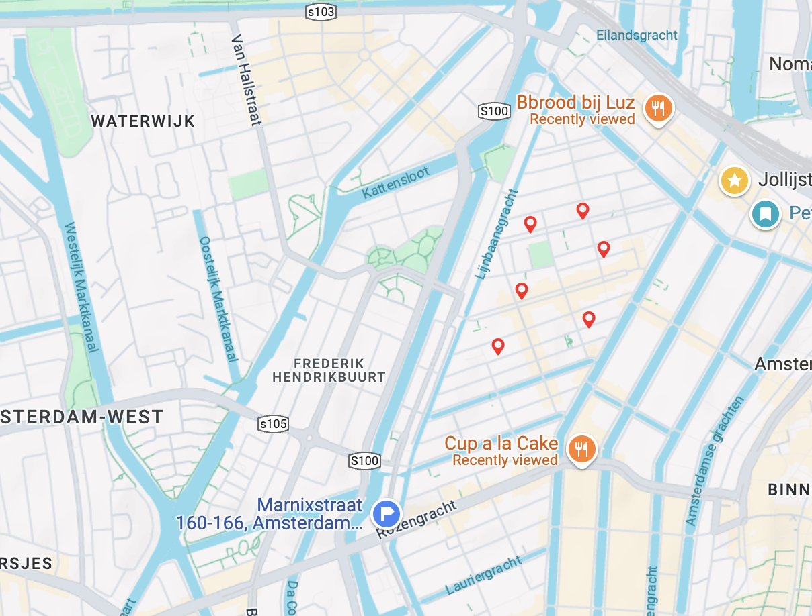

autoscale: true
slidenumbers: true
build-lists: true
list: alignment(left)
footer: Pierangelo Cecchetto - LambdaConf 2025
theme: Poster, 1


# Programs as Values


### Write code and don't get lost

^Hello everyone, and welcome to my talk on "Programs as values", or how to write code and don't get lost

---

# The Code archeologist problem


- "Investigation requests" _(not "Bug Reports")_
- What is the system _doing_?
- What is the system _supposed to do_?

^The suggestion for this talk comes from post that appeared a few months ago on my LinkedIn timeline. My colleague was describing a sort of "Code archeologist problem".  
CLICK - This problem manifests itself when we have   more "Investigation requests" rather than "Bug Reports". This means that not even the business people are sure of what they are reporting
CLICK - And we find ourselves int he awkward situation of having to answer these 2 questions: What is the system doing? 
CLICK - What is the system _supposed to do_ ?
Here are a few examples of how such requests look like:

---

# Investigation Request #1


System consumes documents from Kafka and produces processing proofs. We see _100 messages going in_, and only _70 are OK_. 
  
Why did _30 go to DLQ_?

---

# Investigation Request #2


In a purchase approval system, I see _30 transactions refused out of 100_. Why are they refused?

---

# Investigation Request #3



"We were supposed to see _8 shop locations_ on Google Maps but we see _only 6_. Why is that?"

---

# Investigation Request #3


"We were supposed to see _8 shop locations_ on Google Maps but we see _only 6_. Why is that?"

---
# And to make things more interesting...

- No error messages in our logs


^
To make things even more complicated, none of these situation results in error in our logs. So why don't things work as expected?

---

# The Promise of FP

### Focus on the _what_ rather than the _how_

[.code-highlight: none]
[.code-highlight: 1-6]
[.code-highlight: 1-10]

```scala 
// HOW (Procedural)
val x = List(1, 2, 3) 
val y = scala.collection.mutable.ArrayBuffer.empty[Int]
for (i <- 0 until x.size) {
  y += x(i) * 2
}

// WHAT (Functional)
val x = List(1, 2, 3)
val y = x.map(_ * 2)
``` 

^ FP promises to let us focus on intent rather than the internal mechanism, and it succeeds in cases like this. We can appreciate how the functional approach is clear and easy to understand. 

^But While FP succeeds in simple cases like this, it doesn't keep the promises when we deal with more complex situations, for example when we model a solution for a healthcheck of a running service 

---

# The Promise of FP 
### in Business Logic Problems - Health Check


[.code-highlight: 1-4,36]
[.code-highlight: 1-12,36]
```scala 
/**
 * Check db connectivity
 */
def checkErrors(): ZIO[Transactor[Task] & AdminClient & SttpClient, Nothing, List[StatusError]] = {
  def dbCheck(
    dbType: DbType, 
    checkTables: List[TableName]
  ): ZIO[Transactor[Task], Nothing, List[StatusError]] =
    /*
     * Doobie code    
     */

  def kafkaCheck(
    topics: List[Topic]
  ): URIO[AdminClient, Option[StatusError]] =
    /*
     * ZIO-kafka code
     */

  def httpCheck(
    url: Url
  ): URIO[SttpClient, List[StatusError]] =
    /*
     * Sttp code  
     */

  ZIO
    .collectAll(
      List(
        dbCheck(DbType.MySql, List(TableName("table1"), TableName("table2"))),
        kafkaCheck(List(Topic("topic1"), Topic("topic2"))),
        httpCheck(Url("http://localhost:8080"))
      )
    )
    .map(_.flatten)
}
``` 

^ We have a system connected to Kafka, to Database and to an external application via http. How would a healthcheck look like? 
Here is a straightforward implementation for the healthcheck, One function checks the DB using ZIO and Doobie -> CLICK -> CLICK,


---

# The Promise of FP
### in Business Logic Problems - Health Check


```scala 
  def dbCheck(
    dbType: DbType, 
    checkTables: List[TableName]
  ): ZIO[Transactor[Task], Nothing, List[StatusError]] =
    /*
     * Doobie code    
     */
``` 

---

# The Promise of FP
### in Business Logic Problems - Health Check


[.code-highlight: 1,10-15,33]
```scala 
def checkErrors(): ZIO[Transactor[Task] & AdminClient & SttpClient, Nothing, List[StatusError]] = {
  def dbCheck(
    dbType: DbType, 
    checkTables: List[TableName]
  ): ZIO[Transactor[Task], Nothing, List[StatusError]] =
    /*
     * Doobie code    
     */

  def kafkaCheck(
    topics: List[Topic]
  ): URIO[AdminClient, Option[StatusError]] =
    /*
     * ZIO-kafka code
     */

  def httpCheck(
    url: Url
  ): URIO[SttpClient, List[StatusError]] =
    /*
     * Sttp code  
     */

  ZIO
    .collectAll(
      List(
        dbCheck(DbType.MySql, List(TableName("table1"), TableName("table2"))),
        kafkaCheck(List(Topic("topic1"), Topic("topic2"))),
        httpCheck(Url("http://localhost:8080"))
      )
    )
    .map(_.flatten)
}
``` 

^One that checks the kafka connection using ZIO-kafka -> CLICK -> CLICK

---

# The Promise of FP
### in Business Logic Problems - Health Check


```scala 

  def kafkaCheck(
    topics: List[Topic]
  ): URIO[AdminClient, Option[StatusError]] =
    /*
     * ZIO-kafka code
     */
```

^ and one checks the external http connection using zio and sttp -> CLICK -> CLICK

---

# The Promise of FP
### in Business Logic Problems - Health Check


[.code-highlight: 1,16-22,33]
```scala 
def checkErrors(): ZIO[Transactor[Task] & AdminClient & SttpClient, Nothing, List[StatusError]] = {
  def dbCheck(
    dbType: DbType, 
    checkTables: List[TableName]
  ): ZIO[Transactor[Task], Nothing, List[StatusError]] =
    /*
     * Doobie code    
     */

  def kafkaCheck(
    topics: List[Topic]
  ): URIO[AdminClient, Option[StatusError]] =
    /*
     * ZIO-kafka code
     */

  def httpCheck(
    url: Url
  ): URIO[SttpClient, List[StatusError]] =
    /*
     * Sttp code  
     */

  ZIO
    .collectAll(
      List(
        dbCheck(DbType.MySql, List(TableName("table1"), TableName("table2"))),
        kafkaCheck(List(Topic("topic1"), Topic("topic2"))),
        httpCheck(Url("http://localhost:8080"))
      )
    )
    .map(_.flatten)
}
``` 

---

# The Promise of FP
### in Business Logic Problems - Health Check


```scala

  def httpCheck(
    url: Url
  ): URIO[SttpClient, List[StatusError]] =
    /*
     * Sttp code  
     */
}
``` 

^At the end, we collect the error messages produced by each of them into  a single list

---

# The Promise of FP
### in Business Logic Problems - Health Check


[.code-highlight: 1,23-32,33]
```scala 
def checkErrors(): ZIO[Transactor[Task] & AdminClient & SttpClient, Nothing, List[StatusError]] = {
  def dbCheck(
    dbType: DbType, 
    checkTables: List[TableName]
  ): ZIO[Transactor[Task], Nothing, List[StatusError]] =
    /*
     * Doobie code    
     */

  def kafkaCheck(
    topics: List[Topic]
  ): URIO[AdminClient, Option[StatusError]] =
    /*
     * ZIO-kafka code
     */

  def httpCheck(
    url: Url
  ): URIO[SttpClient, List[StatusError]] =
    /*
     * Sttp code  
     */

  ZIO
    .collectAll(
      List(
        dbCheck(DbType.MySql, List(TableName("table1"), TableName("table2"))),
        kafkaCheck(List(Topic("topic1"), Topic("topic2"))),
        httpCheck(Url("http://localhost:8080"))
      )
    )
    .map(_.flatten)
}
``` 

---

# The Promise of FP
### in Business Logic Problems - Health Check


```scala 
  ZIO
    .collectAll(
      List(
        dbCheck(DbType.MySql, List(TableName("table1"), TableName("table2"))),
        kafkaCheck(List(Topic("topic1"), Topic("topic2"))),
        httpCheck(Url("http://localhost:8080"))
      )
    )
    .map(_.flatten)
``` 

---

# Purely functional code

[.column]

```scala 
def checkErrors(): ZIO[Transactor[Task] & AdminClient & SttpClient, Nothing, List[StatusError]] = {
  def dbCheck(
    dbType: DbType, 
    checkTables: List[TableName]
  ): ZIO[Transactor[Task], Nothing, List[StatusError]] =
    /*
     * Doobie code    
     */

  def kafkaCheck(
    topics: List[Topic]
  ): URIO[AdminClient, Option[StatusError]] =
    /*
     * ZIO-kafka code
     */

  def httpCheck(
    url: Url
  ): URIO[SttpClient, List[StatusError]] =
    /*
     * Sttp code  
     */

  ZIO
    .collectAll(
      List(
        dbCheck(DbType.MySql, List(TableName("table1"), TableName("table2"))),
        kafkaCheck(List(Topic("topic1"), Topic("topic2"))),
        httpCheck(Url("http://localhost:8080"))
      )
    )
    .map(_.flatten)
}
```

[.column]


- _Immutable_ values
- Strongly _typed_ - `neotype`
- _Functional effect_ system - `ZIO`


^The code we just showed is purely functional code, strictly typed, written in a functional effect system, but to understand what is being done, the developer must check the implementation of these methods

---

# Purely functional code


[.column]

```scala 
def checkErrors(): ZIO[Transactor[Task] & AdminClient & SttpClient, Nothing, List[StatusError]] = {
  def dbCheck(
    dbType: DbType, 
    checkTables: List[TableName]
  ): ZIO[Transactor[Task], Nothing, List[StatusError]] =
    /*
     * Doobie code    
     */

  def kafkaCheck(
    topics: List[Topic]
  ): URIO[AdminClient, Option[StatusError]] =
    /*
     * ZIO-kafka code
     */

  def httpCheck(
    url: Url
  ): URIO[SttpClient, List[StatusError]] =
    /*
     * Sttp code  
     */

  ZIO
    .collectAll(
      List(
        dbCheck(DbType.MySql, List(TableName("table1"), TableName("table2"))),
        kafkaCheck(List(Topic("topic1"), Topic("topic2"))),
        httpCheck(Url("http://localhost:8080"))
      )
    )
    .map(_.flatten)
}
```
[.column]

Is it focused on the _how_ or on the _what_?

^
This code is Purely functional, but is it really focused on the what rather than the how? 
I think this suffers from some limitations

---

# Problem #1: Arbitrary functions

[.code-highlight: 1-6,9-11]
[.code-highlight: 1-7,9-11]
[.code-highlight: 1-8,9-11]
```scala
 def checkErrors() = ZIO
  .collectAll(
    List(
      dbCheck(DbType.MySql, List(TableName("table1"), TableName("table2"))),
      kafkaCheck(List(Topic("topic1"), Topic("topic2"))),
      httpCheck(Url("http://localhost:8080")),
      ZIO.succeed(List(StatusError("Fourth error")))
      ZIO.die(new RuntimeException("Error in the fifth check"))
    )
  )
  .map(_.flatten)
```

^One problem is that the door is open to put any function in the collect phase. 
Nothing prevents us from putting there one constant error (CLICK), or even letting the whole computation blow up at runtime(CLICK)

---

# Problem #2: Divergent Documentation

```scala
/**
 * Check db connectivity
 */
  def checkErrors() =
    dbCheck(DbType.MySql, List(TableName("table1"), TableName("table2")))
```
^Another problem is that we might have divergent documentation. 
This was the first version of our function, with a proper documentation

---


# Problem #2: Divergent Documentation

[.code-highlight: 1-8,10-14]
[.code-highlight: 1-9,10-14]
```scala
/**
 * Check db connectivity
 */
def checkErrors() = ZIO
  .collectAll(
    List(
      dbCheck(DbType.MySql, List(TableName("table1"), TableName("table2"))),
      kafkaCheck(List(Topic("topic1"), Topic("topic2"))),
      httpCheck(Url("http://localhost:8080"))
    )
  )
  .map(_.flatten)
```

^
Later in time we kept adding functionality, but documentation remained the same
- Function was initially just checking the DB
- Later added Kafka check
- Then added HTTP check
- Documentation remained outdated

^ This is a common issue in complex systems — implementation evolves, but documentation lags. Documentation can be code documentation, or Confluence/Knowledge base documentation

---

# Problem #3: Solution Bound to ZIO

- Legacy services use `Future` and `Slick`
- No guarantee of _equivalence_ between implementations

^ Migrating to a different technology stack typically requires a complete reimplementation without inherent assurances of functional equivalence. While such migrations are infrequent, a comprehensive health monitoring solution should function consistently across our entire ecosystem—seamlessly integrating with both our modern services built on ZIO and our established systems using Futures and Akka.


---

# Orthogonality

### Address all three problems independently:
1. Constrain what we can do
2. Keep documentation _always_ aligned with code
3. Make solution stack-agnostic

^ A quick digression on orthogonality. Orthogonality means that solving one problem should not affect the solution of the other ones

---

### Define a _Language_ to _describe our solution_

^The solution is: Start with a language that accurately describes the solution

---

# Model the solution 

```scala 
sealed trait ErrorCondition

object ErrorCondition { 
  
  case class DBErrorCondition(dbType: DbType, checkTables: List[TableName]) extends ErrorCondition 
  
  case class KafkaErrorCondition(topics: List[Topic]) extends ErrorCondition 
  
  case class HttpErrorCondition(url: Url) extends ErrorCondition 
}
``` 

^ Here we want to describe the ways in which our application can fail, or rather the possible ways in which an `ErrorCondition` can occur. An `ErrorCondition` can occur if at least one of these error situations occur. And we want to report all of them

---

# Add Combinators

```scala 
sealed trait ErrorCondition

object ErrorCondition { 
  
  case class Or(left: ErrorCondition, right: ErrorCondition) extends ErrorCondition

  case class DBErrorCondition(dbType: DbType, checkTables: List[TableName]) extends ErrorCondition 

  case class KafkaErrorCondition(topics: List[Topic]) extends ErrorCondition 
  
  case class HttpErrorCondition(url: Url) extends ErrorCondition 

}
``` 

^ Now we can combine error conditions using logical operators. Notice we use an `Or` because our system fails if one of the conditions is met

---

# Describe solutions through Data structures

```scala
Or(
  DBErrorCondition(
    DbType.Postgres, 
    List(TableName("user"), TableName("access_token"))
  ), 
  HttpErrorCondition(
    Url("https://license-check.org/check")
  )
)
```

^Here we have one error condition made of an OR of 2 possible conditions, one about DB and one about Http service.
We don't want to be building these things by hand, this is not very handy. Already putting 3 conditions together would make this pretty unreadable.
So let's make it ergonomic

---

# Make it ergonomic

[.code-highlight: 1-3]
[.code-highlight: 1-13]
```scala
sealed trait ErrorCondition { self =>
  def ||(other: ErrorCondition): ErrorCondition = Or(self, other)
}

object Dsl:
  def dbErrorCondition(dbType: DbType, checkTables: TableName*): ErrorCondition =
    DBErrorCondition(dbType, checkTables.toList)
  
  def kafkaErrorCondition(topics: Topic*): ErrorCondition =
    KafkaErrorCondition(topics.toList)
  
  def getHttp2xx(url: Url): ErrorCondition = 
    HttpErrorCondition(url)
``` 

^ By adding this combinator and some constructors we can make the expression of an error condition much easier
CLICK and by adding some constructors we make things even easier. These constructors can be built also using a builder pattern limited just to building that specific term

---

# Make it ergonomic


```scala
val errorCondition =
  dbErrorCondition(DbType.Postgres, 
    TableName("user"), TableName("access_token")
  ) ||
    getHttp2xx(Url("https://license-check.org"))
    
``` 

^with these tools in our belt, we can describe the previous error condition as follows

---

# Flexibility


```scala
val errorCondition =
  dbErrorCondition(DbType.Postgres, 
    TableName("user"), TableName("access_token")
  ) ||
    getHttp2xx(Url("https://license-check.org")) ||
    kafkaErrorCondition("messages-topic")
``` 

^Then we can add another one taking care of kafka

---

# Flexibility


```scala
val errorCondition =
  dbErrorCondition(DbType.Postgres,
    TableName("user"), TableName("access_token")
  ) ||
    getHttp2xx(Url("https://license-check.org")) ||
    kafkaErrorCondition("messages-topic") ||
    dbErrorCondition(dbType, TableName("documents"))
``` 

^And another one for the DB, they don't have to be necessarily all together


---

# Orthogonality

### Address all three problems independently:
1. ✅ Constrain what we can do 
2. ⬜ Keep documentation _always_ aligned with code
3. ⬜ Make solution stack-agnostic

^So with this we addressed the first of our concerns.
^Now let's try to make this thing runnable

---

# Run it: make a `checkErrors()`

Compile the data structure into a function 

```scala 
object ZIOInterpreter { 
  def checkErrors(errorCondition: ErrorCondition) = 
    
    errorCondition match
    
      case ErrorCondition.DBErrorCondition(DbType.Postgres, checkTables) =>
        DoobieZIOdBHealthcheck.status(DoobieZIOdBHealthcheck.existsPostgres, checkTables) 
    
      case ErrorCondition.DBErrorCondition(DbType.MySql, checkTables) => 
        DoobieZIOdBHealthcheck.status(DoobieZIOdBHealthcheck.existsMySql, checkTables) 
    
      case ErrorCondition.HttpErrorCondition(url) => 
        SttpHealthCheck.check(url)
    
      case ErrorCondition.Or(left, right) => 
        interpret(left).zipPar(interpret(right)).map { 
          case (leftErrors, rightErrors) => leftErrors ++ rightErrors 
        } 
}
``` 

^ Once we have the data structure definition in place, we need to make this runnable, and this is what goes by as _interpretation_ or _compilation_. 

^Interpretation is completely free: we have no constraints coming from our DSL about what we need to do with the data structure we built.

^In this implementation, we're using ZIO and Doobie, which means the interpreter serves as the connection point that links our abstract solution to this specific tech stack


^Note that by using pattern matching, the compiler will help us ensure we've covered all cases.

---

# Interpreter: the bare minimum


```scala
sealed trait ErrorCondition

def checkErrors(ec: ErrorCondition): UIO[List[Errors]] =
  ec match {
    //cover all cases
  }
  
```

^At a minimum, an interpreter must match the possible cases of the base sum type, but it can do more. For example it can optimize before running

---

# Interpreter: optimize before running


```scala
sealed trait ErrorCondition

private def optimize(ec: ErrorCondition): ErrorCondition = 
 /*
  * collect all checks of the same type, to minimize the calls
  */

def checkErrors(ec: ErrorCondition): UIO[List[Errors]] =
  optimize(ec) match {
    //cover all cases
  }
  
```

^
one possible optimization in our case would be to traverse the data structure, collect all the conditions of the same type in a monoidal way and run just one call to the targeted platform 

---

# Benefits: Tech stack Independence

For a Future/Slick implementation:

```scala 
  def checkErrors(
    db: slick.jdbc.JdbcBackend#Database, 
    jdbcProfile: slick.jdbc.JdbcProfile, 
    httpClient: SttpFutureBackend[Future, Any]
  )(
    errorCondition: ErrorCondition )(implicit ec: ExecutionContext): Future[List[StatusError]] = 
      errorCondition match {
        // Different implementation, same logic 
      }
``` 

^ We can create different interpreters for different tech stacks

---

# Benefits: Documentation from Code

[.column]

```scala 
def interpret(errorCondition: ErrorCondition): String =
  errorCondition match {
    //render (statefully) all cases
  }
```

[.column]

_

---

# Benefits: Documentation from Code

[.column]

```scala 
def interpret(errorCondition: ErrorCondition): String =
  errorCondition match {
    //render (statefully) all cases
  }
``` 
[.column]

Output:

```
Either of:
Database Check (Postgres):
  Required tables: customer, access_token
OR
Kafka Check:
  Required topics: events
OR
HTTP Check:
  URL: http://localhost:8080/status/200
are detected for failure
``` 

^ Generate documentation directly from the code structure
^Here we are generating a String, we could generate a LaTeX document, or push a markdown to our Git Repo, there are endless possibilities here 

---

# Orthogonality

### Address all three problems independently:
1. ✅ Constrain what we can do
2. ✅ Keep documentation _always_ aligned with code
3. ✅ Make solution stack-agnostic

^With this in place, our documentation is _always_ aligned with the error condition we decide to detect.
^We also proved that we can adapt our solution to the stack we want to use


---

# Evolution of the Language

New requirement ⇒ New term in the algebra

```scala 
case class RabbitMQErrorCondition(exchanges: List[Exchange]) extends ErrorCondition

def rabbitMQErrorCondition(topics: Exchange*): ErrorCondition =
  RabbitMQErrorCondition(topics.toList)
``` 

^ The language evolves as our requirements evolve

---

# Compiler-Enforced Consistency
```
[warn] 17 |    errorCondition match
[warn]    |    ^^^^^^^^^^^^^^
[warn]    |match may not be exhaustive.
[warn]    |
[warn]    |It would fail on pattern case: domainmodeling.healthcheck.ErrorCondition.RabbitMQErrorCondition(_)
``` 

^ The compiler tells us when our interpreters need updating

---

# A More Complex Example
### Payment Authorization Rules

_The problem: Authorizing payments based on complex evolving rules_

<br/>

```scala 
def isBlocked(creditCard: CreditCard, purchase: Purchase): Boolean
``` 

^ Here we want a function that blocks transactions, based on defined rules

---

# Domain Model
```scala 
 case class CreditCard(
  id: Id,
  cardNumber: CardNumber,
  cardHolderName: CardHolderName,
  cardType: CardType,
  expiryDate: ExpiryDate,
  issuedInCountry: Country
)

case class Purchase(
  id: Id,
  creditCardId: Id,
  amount: Amount,
  shop: Shop
)

case class Shop(
  id: ShopId,
  name: ShopName,
  country: Country,
  categories: List[ShopCategory]
)
``` 

^ Our domain contains credit cards, purchases, and shops

---

# Payment Approval system

```scala
def isBlocked(creditCard: CreditCard, purchase: Purchase): Boolean
```

^So we have our function to determine if the usage of a given CC for a given purchase is blocked

---

# First Requirement

> _"Block all electronic purchases in China"_

Naive implementation:

```scala
 def isBlocked(creditCard: CreditCard, purchase: Purchase):  Boolean =
  purchase.shop.country == Country.China && purchase.shop.categories.contains(ShopCategory.Electronics))
```

^Here is our first requirement, with a very straightforward implementation.
But our PO told us that this rule would become more complex over time, so let's prepare our language to model mode complex rules.
We follow exactly the same approach we followed in the healthckeck example

---

# Building the basic rules

```scala
sealed trait BlockingRule

case class PurchaseOccursInCountry(country: Country)                  extends BlockingRule

case class PurchaseCategoryEquals(purchaseCategory: ShopCategory)     extends BlockingRule

case class PurchaseAmountExceeds(amount: Double)                      extends BlockingRule

case class FraudProbabilityExceeds(threshold: Probability)            extends BlockingRule

case class CreditCardFlagged()                                        extends BlockingRule

case class ShopIsBlacklisted()                                        extends BlockingRule
```

^ We define the base cases for our blocking rules

---

# Adding Combinators

```scala
sealed trait BlockingRule { self =>
    def &&(other: BlockingRule): BlockingRule = BlockingRule.And(self, other)
    def ||(other: BlockingRule): BlockingRule = BlockingRule.Or(self, other)
}
```

^ We add logical operators to combine rules, and corresponding extra terms in the `BlockingRule` sum type  

---

# User-Friendly Constructors

[.code-highlight: 1-21]
[.code-highlight: 2-7]
```scala
object DSL {
  private def purchaseInCountry(country: Country): BlockingRule =
    BlockingRule.PurchaseOccursInCountry(country)
  
  def purchaseCountryIsOneOf(countries: Country*): BlockingRule = 
    countries.map(purchaseInCountry).reduce(_ || _)
  
  private def purchaseCategoryEquals(purchaseCategory: ShopCategory): BlockingRule =
    BlockingRule.PurchaseCategoryEquals(purchaseCategory)
  
  def purchaseCategoryIsOneOf(purchaseCategories: ShopCategory*): BlockingRule =
    purchaseCategories.map(purchaseCategoryEquals).reduce(_ || _)
  
  def purchaseAmountExceeds(amount: Double): BlockingRule           = BlockingRule.PurchaseAmountExceeds(amount)
  
  def fraudProbabilityExceeds(threshold: Probability): BlockingRule = BlockingRule.FraudProbabilityExceeds(threshold)
  
  def creditCardFlagged: BlockingRule                               = BlockingRule.CreditCardFlagged()
  
  def shopIsBlacklisted: BlockingRule                               = BlockingRule.ShopIsBlacklisted()
}
```

^ Helper methods make our DSL read naturally. Notice that we can also define some constructors based on combination of existing terms

---

# Rule Interpreter

```scala
  def isBlocked(
    ccFlaggedService: CreditCardFlaggedService,
    fraudScoreService: FraudScoreService, 
    shopRepository: ShopRepository)(
    rule: BlockingRule
  )(cc: CreditCard, p: Purchase): UIO[Boolean] = {
    def eval(rule: BlockingRule): UIO[Boolean] = rule match {
      case BlockingRule.PurchaseOccursInCountry(country) =>
        purchaseOccursInCountry(BlockingRule.PurchaseOccursInCountry(country))(input)
      case BlockingRule.PurchaseCategoryEquals(purchaseCategory) =>
        purchaseCategoryEquals(BlockingRule.PurchaseCategoryEquals(purchaseCategory))(cc, p)
      case BlockingRule.PurchaseAmountExceeds(amount) =>
        purchaseAmountExceeds(BlockingRule.PurchaseAmountExceeds(amount))(input)
      case BlockingRule.CreditCardFlagged() => creditCardFlagged(ccFlaggedService)(cc, p)
      case BlockingRule.FraudProbabilityExceeds(threshold) =>
        fraudProbability(BlockingRule.FraudProbabilityExceeds(threshold), fraudScoreService)(cc, p)
      case BlockingRule.And(l, r) => eval(l).zipWith(eval(r))(_ && _)
      case BlockingRule.Or(l, r)  => eval(l).zipWith(eval(r))(_ || _)
      case BlockingRule.ShopIsBlacklisted() => shopRepository.isBlacklisted(p.shop.id)
    }

    eval(rule)
  }
```

^ The execution interpreter needs some dependencies in order to evaluate the rule.

---

# Documentation from code: Mermaid


<br/>

```scala 
def toMermaidCode(blockingRule: BlockingRule): UIO[String] = // ...
``` 

^
Sometimes a visual representation is better than any long comment or Confluence page. So we  decided to interpret our rules as visual diagrams

---

# Rule Evolution: V1

```scala
val br1 = 
  purchaseCountryIsOneOf(Country.China) && 
    purchaseCategoryIsOneOf(ShopCategory.Electronics)
```


^And here is our first rule, to  block electronics purchases in China.
After a while our PO comes with a new requirement, we want to block also gambling transactions in UK
^CLICK

---

# Rule Evolution: V2

```scala
val br1 =
  purchaseCountryIsOneOf(Country.China) &&
    purchaseCategoryIsOneOf(ShopCategory.Electronics)
    
val br2 = br1 || 
  (purchaseCountryIsOneOf(Country.UK) && 
    purchaseCategoryIsOneOf(ShopCategory.Gambling))
```


^ And the third version adds more complex rules for italy, excluding some categories when the purchase amount is higher than 1000 and the fraud probability for the operation is higher than 80%

---

# Rule Evolution: V3

```scala
val br1 =
  purchaseCountryIsOneOf(Country.China) &&
    purchaseCategoryIsOneOf(ShopCategory.Electronics)

val br2 = br1 ||
  (purchaseCountryIsOneOf(Country.UK) &&
    purchaseCategoryIsOneOf(ShopCategory.Gambling))

val br3 = br2 || 
  (
    purchaseCountryIsOneOf(Country.Italy) &&
      purchaseCategoryIsOneOf(
        ShopCategory.Gambling,
        ShopCategory.Adult
      ) && 
      purchaseAmountExceeds(1000) && 
      fraudProbabilityExceeds(Probability(0.8))
  )
```


^ Our third version adds complex rules for Italy.
This automatic documentation has become so successful that now business writes stories in terms of these pictures

---

# Benefits
- _**Constrain the possibilities**_ - Define a minimum set of things we can do, and build from there 
- _**Self-Documenting**_ - Text/Visual representation directly from code
- _**Technology Independent**_ - Same rules, different implementations
- _**Evolving Safely**_ - Compiler catches missing cases
- _**Optimization**_ - We can transform the rule tree before execution

^ These are the key advantages of treating programs as values

---

# ...and there is more!

_**Not only algorithmic problems:**_

- ETL processing pipelines
- Workflows
- API requests _(Tapir, ZIO-http)_
- Domain-specific calculations


^ This approach works for many different problem domains

---

# ...and there is more!

_**Further developments:**_

- _Serialize/Deserialize_ your business logic, version, revert
- _Derive_ frontend
- _Derive_ a visual _debugger_ for complex logic

^ Further development based on this approach would include: 
- serialize/deserialize the logic, so we can version it, revert, deploy
- We can write an interpreter of our data structure even in another language. Imagine you serialize your structure in json and you interpret it in React
- One application of this would be to derive a visual debugger for our business logic

---

# Scala  shines...
- Compiler _exhaustive checks_
- _Phantom types_ to make unwanted constructions impossible
- _`given`_ to limit possible combinations

---

# ...but all you need is data
- Languages with good _ADT_
- Pattern matching (data _de-construction_)
- Data with _methods_ for ergonomics 


---

# _**Keep it Simple**_

- No need for _HKTs_ unless you really necessary
- _Restrict operations_ to a limited set
- We _don't always need monads_ in high-level problems


^ Simplicity is a feature, not a limitation. We don't need to learn free monads, natural transformations etc to implement this. 
Moreover, `map/flatmap` are typically required in lower level languages, but if you are reasoning about business problems you can just constrain the possible functions you want to allow in your DSL

---

# _**Conservation Principle**_


 **Clear**
 = 
 easy to _understand_, _document_, _evolve_

---

# _**Conservation Principle**_


_Constraints Liberate, Liberties Constrain_ — **Runar Bjarnason**

---

#Thank You!

_**Questions?**_


^
TODO's:
mention Runar's talk
Introduce a conservation principle: Expressivity + Reasonability = Constant. The more I can express with a language, the more difficult it is to reason about what I'm doing with that language.